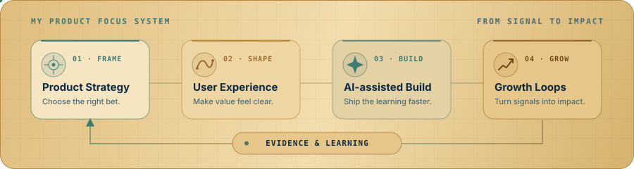

  

  
  
  

 

## I turn ambiguous product problems into shippable systems.

I'm **Sajjad Dehghan**, a Product Specialist at **LinkUp** and an AI-assisted product builder based in Tehran. I work where product thinking meets hands-on execution—connecting discovery, UX, growth, rapid prototyping, and delivery into one measurable loop.

My sweet spot is taking a fuzzy opportunity and making it concrete: a clear problem, a testable experience, a working MVP, and the evidence needed to decide what comes next.

<table>
  <tr>
    <td width="33%" valign="top">
      <h3>🔎 Discover</h3>
      
Frame the right problem through user insight, market context, and evidence—not assumptions.

    </td>
    <td width="33%" valign="top">
      <h3>🧭 Design</h3>
      
Turn complexity into focused journeys, prototypes, experiments, and product decisions.

    </td>
    <td width="33%" valign="top">
      <h3>🚀 Deliver</h3>
      
Use AI-assisted workflows to ship faster, validate sooner, and learn from real signals.

    </td>
  </tr>
</table>

## What I'm focused on

  

- Building **LinkUp**, a bilingual talent marketplace connecting Iranian talent with global opportunities through AI-assisted proposals, real-time collaboration, escrow, and wallet infrastructure.
- Developing an open, evidence-driven **Product Operations OS** for repeatable idea-to-release workflows.
- Exploring how AI agents can reduce product-operation overhead without weakening human judgment or quality controls.

## The journey behind the work

My foundation in software, data, and AI taught me how systems are built. Product management taught me to ask a more important question first: **what deserves to be built—and why?**

In 2025, I completed Diginext Academy's intensive 8-week, in-person **Product Management Bootcamp**, working on real product challenges with professional mentorship. Today, I bring those two worlds together: technical fluency for fast execution, and product judgment for meaningful outcomes.

## Selected work

| Project | What it demonstrates | Built with |
| :--- | :--- | :--- |
| [**Open Product Operations OS**](https://github.com/sedwna/open-product-operations-os) | A vendor-neutral operating system for evidence-driven idea-to-release work, including agents, workbooks, QA, and independent controls. | JavaScript · Product Ops · AI agents |
| [**BAXI**](https://github.com/sedwna/BAXI) | A transportation marketplace connecting drivers and customers across multiple service types. | Python · Marketplace UX |
| [**ChatterAI**](https://github.com/sedwna/ChatterAI) | An intent-aware chatbot using Bag of Words and weighted-embedding LSTM techniques. | Python · NLP · Machine Learning |
| [**Image2Text Translate**](https://github.com/sedwna/Image2Text-Translate) | A practical OCR workflow that extracts text from images and translates it into Persian. | Python · OCR · Translation |

## Product toolkit

## Building in public & private

<picture>
  <source media="(prefers-color-scheme: dark)" srcset="https://raw.githubusercontent.com/sedwna/sedwna/output/monthly-activity-snake-dark.svg" />
  <source media="(prefers-color-scheme: light)" srcset="https://raw.githubusercontent.com/sedwna/sedwna/output/monthly-activity-snake.svg" />
  
</picture>

Public work and anonymized private contribution counts are included; private repository details stay private.

  
  

---

  <strong>Good products are not just shipped—they are understood, tested, and improved.</strong>
    
  

